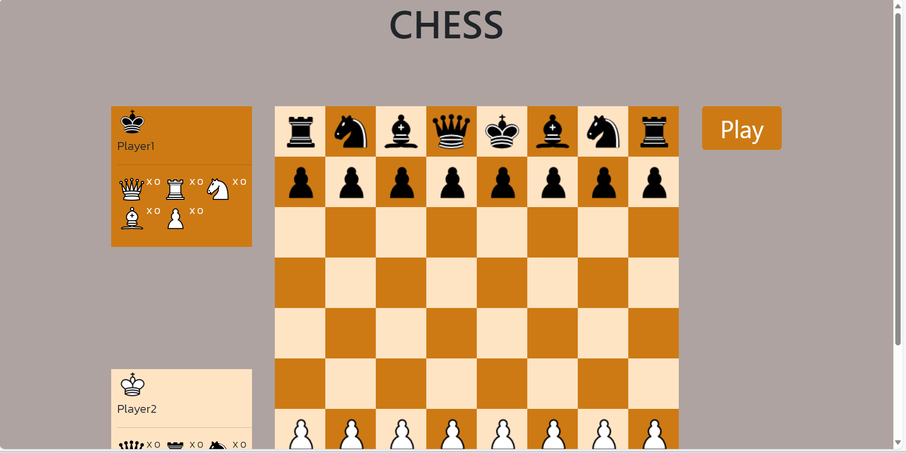
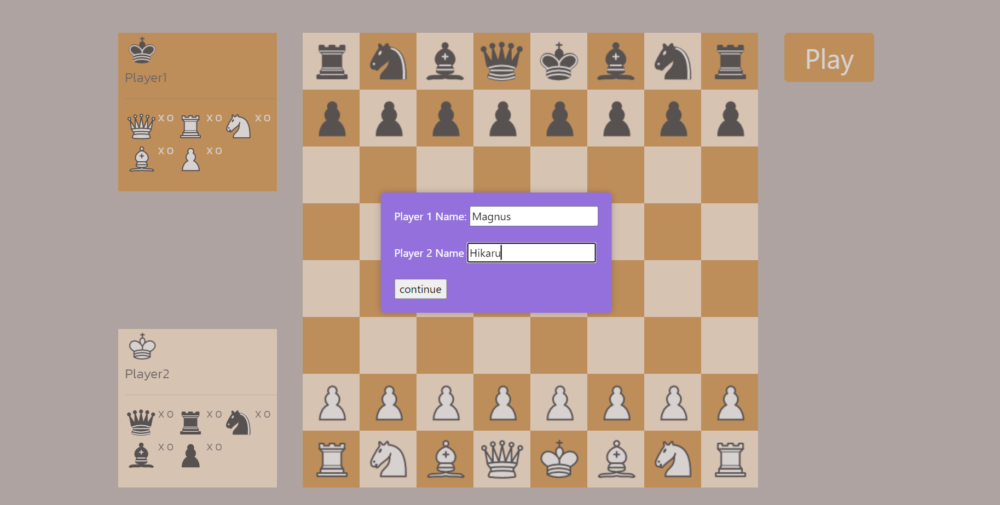
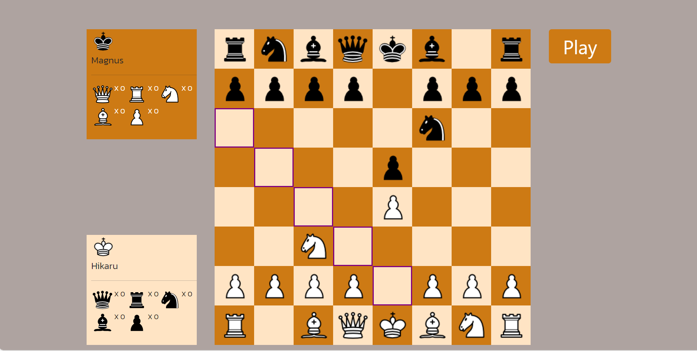

# About 

It is created using html/css javascript(Jquery) for frontend and expressjs with nodejs for backend

# Run the program
Install Vscode

Install nodejs 

open the folders in your vscode

select new terminal and select gitbash

" cd <folder_directory> " command to change directory

" npm i " - to install all the packages i have used

if you don't have nodemon , "npm install -g nodemon" 

To run the website "nodemon server-index.js"

You can find the website on http://localhost:3000/

# Web pics

